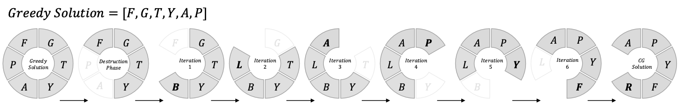

<p align="center">
  
</p>
## 🌀 The Carousel Greedy Algorithm

The **Carousel Greedy (CG)** algorithm, originally introduced by [Cerrone et al., 2017](https://doi.org/10.1016/j.cor.2017.03.016), generalizes the classical greedy approach to overcome one of its main limitations — the *irreversibility* of early decisions.  
Traditional greedy algorithms are simple and fast, but the choices made during the initial construction phase are often short-sighted, leading to suboptimal final solutions.  
In contrast, metaheuristics such as local search or evolutionary algorithms allow for deeper exploration of the solution space, but at the cost of greater complexity and longer computation times.

---

### 🔍 Key Idea

CG extends the intermediate phase of greedy construction, where the algorithm already has partial knowledge that allows for more reliable decisions.  
To achieve this, two control parameters are introduced:

- **α (alpha)** — an integer controlling the number of iterations in the refinement phase, i.e., how long the algorithm continues to update the solution.  
- **β (beta)** — a percentage determining the fraction of elements to remove from the initial solution before starting the refinement, allowing subsequent replacements.

These two parameters enable CG to interleave *construction*, *destruction*, and *refinement* steps, resulting in an algorithm with four main phases:

1. **Construction Phase** – builds an initial solution using a greedy criterion.  
2. **Destruction Phase** – removes a fraction β of the most recently added elements.  
3. **Iterative Phase** – for α·|S| iterations (where |S| is the size of the initial solution), repeatedly removes the oldest element and inserts a new one chosen by the greedy criterion, thus correcting early poor decisions.  
4. **Completion Phase** – restores feasibility (if needed) by re-adding essential elements through the basic greedy procedure.


<sub>*Figure: Schematic overview of the four phases of the Carousel Greedy algorithm.*</sub>

---

### 🧠 Applications

Since its introduction, the Carousel Greedy algorithm has been successfully applied to a wide range of **combinatorial optimization problems** and beyond — including:

- **Graph-based problems**: Minimum Label Spanning Tree, Vertex Cover, Community Detection.  
- **Routing and logistics**: Vehicle Routing, Maximum Flow, Grocery Distribution Planning.  
- **Knapsack and resource allocation problems.**  
- **Data-driven contexts**: Feature Selection and Social Network Analysis.  

Its **flexibility** and **low computational cost** have made CG a valuable metaheuristic for problems where full-fledged optimization methods are too slow or complex to implement.

For a comprehensive list of applications and references, see the works summarized in the scientific literature:

| Reference | Title |
|------------|--------|
| Cerrone et al. (2017) | *Carousel Greedy: A generalized greedy algorithm with applications in optimization* |
| Carrabs et al. (2017) | *Column generation embedding CG for the maximum network lifetime problem* |
| Cerrone et al. (2018) | *An efficient and simple approach to solve a distribution problem* |
| Hadi et al. (2019) | *An efficient approach for sentiment analysis in a big data environment* |
| Cerrone et al. (2019) | *Heuristics for the strong generalized minimum label spanning tree problem* |
| Kong et al. (2019) | *A hybrid iterated CG algorithm for community detection in complex networks* |
| Cerulli et al. (2020) | *The knapsack problem with forfeits* |
| Hammond et al. (2020) | *Survey of UAV set-covering algorithms for terrain photogrammetry* |
| Carrabs et al. (2020) | *An adaptive heuristic approach to compute bounds for the CETSP* |
| Cerrone et al. (2021) | *Grocery distribution plans in urban networks with penalties* |
| Cerulli et al. (2022) | *Maximum network lifetime problem with time slots and coverage constraints* |
| Capobianco et al. (2022) | *A hybrid metaheuristic for the knapsack problem with forfeits* |
| Shan et al. (2021) | *An iterated CG algorithm for finding minimum positive influence dominating sets* |
| D’Ambrosio et al. (2023) | *The knapsack problem with forfeit sets* |
| Wang et al. (2023) | *Carousel Greedy algorithms for feature selection in linear regression* |
| Carrabs et al. (2025) | *Hybridizing Carousel Greedy and Kernel Search for the maximum flow problem with conflicts* |

---

🧩 **In summary**, CG represents a powerful balance between **efficiency** and **exploration**, making it a practical choice for a variety of discrete and data-driven optimization problems.  
This library provides a modular, open-source implementation of CG in **R**, designed to make its use straightforward and adaptable across diverse problem domains.


# R-CarouselGreedy

**A modular and high-performance R implementation of the Carousel Greedy algorithm.**

`R-CarouselGreedy` is an open-source R package implementing the Carousel Greedy (CG) metaheuristic — a flexible and general-purpose algorithm for solving a wide range of combinatorial optimization problems.  
The package is designed with a focus on modularity, extensibility, and computational efficiency using R’s functional programming capabilities.

> 📄 Submitted Article:  
> *A Multi-Language Framework for the Carousel Greedy Algorithm: Python, R, MATLAB, and Julia Implementations*  
> Raffaele Dragone, Carmine Cerrone, Bruce L. Golden  
> Submitted to *SoftwareX*

---

## ✨ Features

- Modular architecture and easy customization.  
- Designed for any discrete optimization problem (e.g., vertex cover, knapsack, minimum label spanning tree).  
- Includes a ready-to-run example for the Minimum Vertex Cover Problem.  
- Fully documented and open-source.

---

## 📦 Availability

The package is publicly available on CRAN and GitHub.  
The full source code, documentation, and usage examples are hosted on GitHub:

- CRAN: [https://cran.r-project.org/package=carouselgreedy](https://cran.r-project.org/package=carouselgreedy)  [TBD]
- GitHub: [https://github.com/RaffaeleDragone/carouselgreedy](https://github.com/RaffaeleDragone/carouselgreedy)

---

## 🔧 Usage Example

```r
library(carouselgreedy)

# Define feasibility function
my_feasibility <- function(self, solution) {
  # User-defined feasibility check
  # Return TRUE if solution is feasible
  ...
}

# Define greedy evaluation function
my_greedy <- function(self, solution, candidate) {
  # User-defined greedy evaluation
  # Return a numeric score for the candidate
  ...
}

solver <- CarouselGreedySolver(
  feasibility = my_feasibility,
  greedy = my_greedy,
  candidate_elements = my_candidates, # Vector or list of elements
  data = custom_data,
  alpha = 10,
  beta = 0.2
)

best_solution <- minimize(solver)
```

---

## 📂 Examples

You can find a ready-to-run example in the `examples/` folder:

- `examples/mvc/mvc.R` – Minimum Vertex Cover Problem  

This example demonstrates how to define problem-specific greedy and feasibility functions.

---

## 🧩 Core Functions

When creating a `CarouselGreedySolver`, the user must define two fundamental functions — one for **feasibility** and one for the **greedy evaluation**.  
The function names can be freely chosen, but they must follow the structure and semantics described below.

### 🟢 Feasibility Function

```r
my_feasibility <- function(self, solution) {
  ...
}
```

#### Parameters
- **`solver`** — the instance of `CarouselGreedySolver`, which stores all internal data, including the current solution, the full list of candidate elements, and the optional problem-specific structure (`solver$data`), such as a graph or cost matrix.  
- **`solution`** — a vector or list containing the currently selected elements.

#### Returns
A Boolean value (`TRUE` if the current solution satisfies all constraints, `FALSE` otherwise).

---

### 🟣 Greedy Function

```r
my_greedy <- function(self, solution, candidate) {
  ...
}
```

#### Parameters
- **`solver`** — instance of `CarouselGreedySolver`.  
- **`solution`** — current partial solution (vector or list of elements).  
- **`candidate`** — element under evaluation for potential inclusion in the solution.

#### Returns
A numeric value representing the score or priority of the candidate.  
The algorithm always selects the element with the **highest score**, regardless of the problem type.

---

These user-defined functions must be passed as arguments to the `CarouselGreedySolver` constructor.  
The algorithm automatically calls them during the **construction**, **destruction**, **iterative**, and **completion** phases to guide the search process.

---

## ⚙️ Solver Parameters

The behavior of the `CarouselGreedySolver` can be customized through several parameters, which can be overridden when creating the solver instance. Additionally, the parameters `alpha` and `beta` can also be redefined at runtime by passing arguments to the `minimize()` and `maximize()` functions.

- **`alpha`** — Integer controlling the number of refinement iterations in the iterative phase.  
- **`beta`** — Fraction of elements removed during the destruction phase (between 0 and 1).  
- **`data`** — Optional structure containing problem-specific information such as graphs, matrices, or other relevant data.  
- **`candidate_elements`** — Vector or list containing all possible candidate elements, of any type, that may be included in the solution.  
- **`random_tie_break`** — Logical (default `TRUE`) indicating whether ties between candidates with equal scores are resolved randomly.  
- **`seed`** — Integer seed used to initialize the internal random number generator for reproducibility.  

These parameters provide flexibility to adapt the solver to various problem domains and experimental settings.

---

## 🧑‍🔬 Citation [TBD]

If you use this library in academic work, please cite:

```bibtex
@article{dragone2024multilanguage,
  title={A Multi-Language Framework for the Carousel Greedy Algorithm: Python, R, MATLAB, and Julia Implementations},
  author={Dragone, Raffaele and Cerrone, Carmine and Golden, Bruce L.},
  journal={SoftwareX},
  volume={XX},
  pages={XXX--XXX},
  year={2026},
  publisher={Elsevier}
}
```

---

## 📬 Contact & Contributions

Contributions and pull requests are welcome!  
For suggestions or collaborations, contact:

- `raffaele.dragone@edu.unige.it`

---

## 📄 License

This project is distributed under the **BSD 3-Clause License**.  
See the [LICENSE](./LICENSE) file for details.